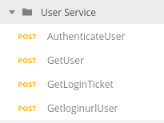

# DEPRECATED
 **The Meetings-related XML APIs will be deprecated and the End-of-Support (EoS) date is planned for the second half of 2023. Cisco will continue to resolve bugs up to this date, but new features will only be implemented for the REST APIs suite. The End-of-life (EoL) timeframe for Meetings-related XML APIs is targeted for March 31, 2024, at which time the APIs will be retired. For information on how to migrate from XML to REST APIs, please see [Webex Meetings XML to REST Migration Guide](https://developer.cisco.com/docs/webex-meetings/#xml-to-rest-migration-guide). User management APIs such as CreateUser, SetUser, DelUser, etc. are NOT affected by this EOL announcement.**

This repo gathers collections for the **[Webex Meetings XML API](https://developer.cisco.com/docs/webex-meetings/#!xml-api)**.

- **[Webex Meetings XML (End user)](#webex-meetings-xml-enduser)**: Requests accessible by a non-admin Webex Meetings user
<!-- - **[Webex Meetings XML (Admin)](#webex-meetings-xml-admin)**: Requests requring admin privileges -->

If you're new to Postman, you're only a few steps away from getting the full benefits of the collections:

1. [import and configure](docs/ImportAndConfigure.md) a collection 
2. [generate code](docs/GenerateCode.md) for your favorite language
3. [run collections as part of your CI/CD process](https://www.getpostman.com/docs/newman_intro) via the `newman` command
4. [publish documentation via documenter](https://www.getpostman.com/docs/creating_documentation).

**We welcome pull requests for enhancements of existing collections, as well as contributions of collections that proved to be handy for you. 
When submitting a new collection, please ensure it leverages `{{SITE_NAME}}`, `{{WEBEXID}}`, and `{{PASSWORD}}` variables to ease environment sharing among collections. Thank you!** 

## [webex-meetings-xml-enduser](https://raw.githubusercontent.com/CiscoDevNet/postman-webex-meetings-xml/master/webex-meetings-xml-enduser.json)

<!--  -->

The collection implements the end-user availalbe resources for the Webex Meetings XML API.

Worth mentionning that the collection is scripted so that you can run API calls sequentially for the collection as a whole - either manually or via the Postman test runner:

- As you run API calls from top to bottom, newly created resource identifiers (e.g. sessionTicket) are automatically retreived and injected into your Postman environment as temporary variables
- The next API call will retrieve any needed values from the Postman environment, and execute in the context of the previous request. For example, listing meeting attendees for a meetingkey created in a previous request 
- The final request(s) in each folder clean up any created objects, so that you'll end up in the same state as before running the requests

Enough talk, let's practice:

1. [Import the webex-meetings-xml-enduser collection](docs/ImportAndConfigure.md)
1. Ceate or select a [Postman environment](https://learning.getpostman.com/docs/postman/environments_and_globals/manage_environments/) that contains the `{{SITE_NAME}}`, `{{WEBEXID}}`, and `{{PASSWORD}}` variables for your site/user

1. Now, you're ready to invoke the API: for example, go to the **User Service** folder, and run the requests from top to bottom

    

4. Now, what about generating some code for your favorite language?

    Follow the [Generate Code Guide](docs/GenerateCode.md) and have this Python code snippet automatically generated for the API "AuthenticateUser":

    

<!-- Note that the collection is also rendered in HTML for [quick browsing via Postman Documenter](https://documenter.getpostman.com/view/30210/71CYsEp). -->

<!-- 

## [webex-meetings-xml-admin](https://raw.githubusercontent.com/CiscoDevNet/postman-webex-meetings-xml/master/webex-meetings-xml-admin.json)

This collection illustrates the XML API admin requests.

Note that the collection is also rendered in HTML for [quick browsing via Postman Documenter](https://documenter.getpostman.com/view/30210/2PMC7h).

-->

