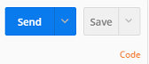
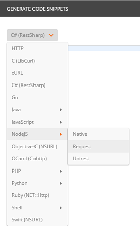
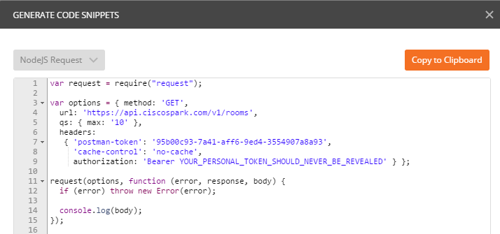

# Code generation with Postman

Postman lets you [generate code](https://www.getpostman.com/docs/code_snippets) in up to 15 languages.

Simply select a request in your collection, and click on the **Code** link, right under the Save button.

As the code generation popup opens, pick your favorite language from the combo box.

Check the code generated by postman.

Here is an example code snippet generated for Node.js:

Note that if you look at it carefully, you may notice an extra header "postman-token" - you probably won't want this in your code.  You can disable generation of this header in the settings under **General**/Headers

