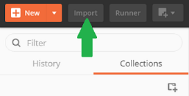
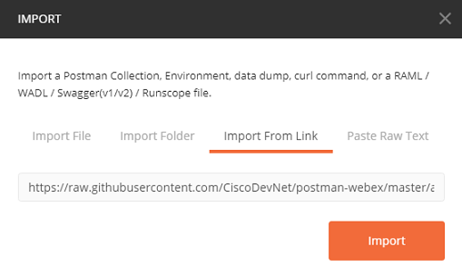
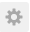
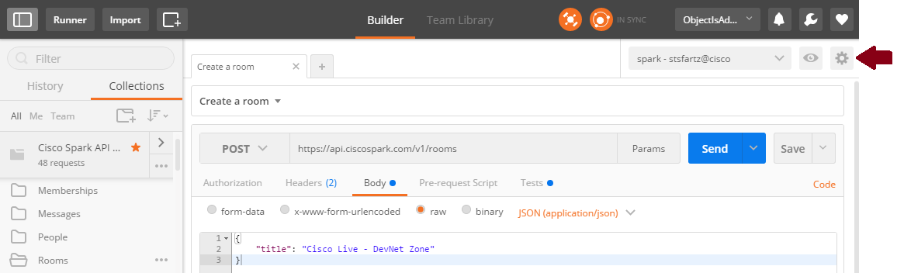
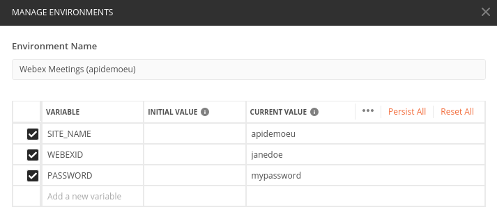

# Import and configure a collection

## Not a Postman user yet ?

The tool comes with a free basic plan.

[Download](https://www.getpostman.com/)

## How to import a collection into postman

Click on the **Import** button on the top left corner:

Select "Import from link" and specify the URL of the collection to import (or browse for the collection `.json` file).

To import a collection directly from this repo:

- View the source code page of the collection you want to import
- Select the **Raw** view option
- Copy the resultng link from your browser URL and import in Postman

## Configure your execution environement

Postman lets you define [environment variables](https://www.getpostman.com/docs/environments) to easily abstract your execution contexts.

This is where we'll specify the site name, Webex user Id and password to use with the Webex Meetings XML API.

> Tip: 
> create [several environments to switch](https://www.getpostman.com/docs/test_multi_environments) from one Webex account to another.
> As for instance, to jump back and forth from your personal account to one or several test accounts

To create a new environment, click on the  icon in the upper right corner, and select **Manage environments**.

In the "Manage environments" dialog, add the `{{SITE_NAME}}`, `{{WEBEXID}}`, `{{PASSWORD}}` variables, and enter your Webex details into the **CURRENT VALUE** column

>Note: be careful about putting passwords into the **INITIAL VALUE** column, as if you export/share the collection with someone else it will contain your password

Note that you can retrieve your personal access token from the [Webex for Developers Getting Started](https://developer.webex.com/getting-started.html#authentication) page.

